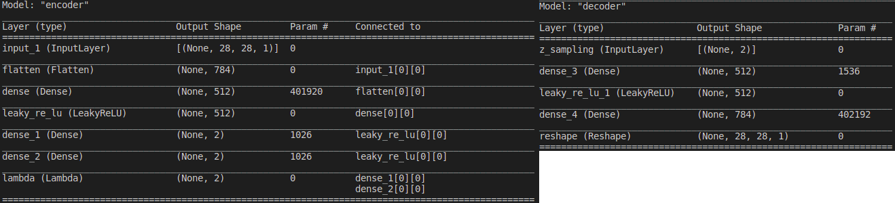
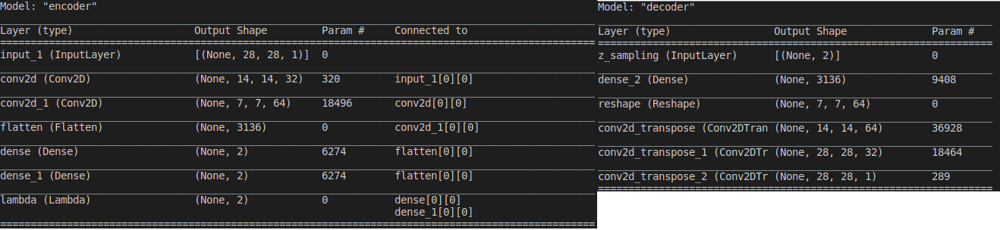

# Auto-Encoding_Variational_Bayes
## 1. Required packages:
- Tensorflow 2. 
- Numpy, Matplotlib
- Argparse
  
## 2. How to run file VAE.py and AE.py
 
   Run the command:

   a) python -m VAE -a architecture -d dataset_name -n number_iterations -b batch_size -s sample_interval

   Example: python -a CNN -m VAE -n 20000 -b 64 -s 2000

   b) python -m AE

   If we do not type 'dataset_name', number_iterations, batch_size, sample_interval, the program will set default value.
## 3. The architecture of encoder and decoder for VAE:
   - MLP
     
   - CNN
     
## 4. The architecture for Auto-encoder is similar to the one of VAE.
